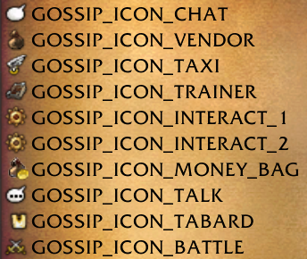

Gossip_menu_option

**`gossip_menu_option` 表**
此表存储闲谈NPC可用的菜单选项信息。

选项示例："训练我！"、"我想遗忘天赋"、……

**结构**

| **字段**                | **类型**               | **属性**   | **键** | **Null** | **默认值** |
| ----------------------- | ---------------------- | ---------- | ------ | -------- | ---------- |
| menu_id                 | smallint(6) unsigned   |            | 主键   | 否       | 0          |
| id                      | smallint(6) unsigned   |            | 主键   | 否       | 0          |
| option_icon             | smallint(6) unsigned   |            |        | 否       | 0          |
| option_text             | text                   | signed     |        | 是       | NULL       |
| option_broadcast_text   | int(11) unsigned       |            |        | 否       | 0          |
| option_id               | tinyint(3) unsigned    |            |        | 否       | 0          |
| npc_option_npcflag      | int(10) unsigned       |            |        | 否       | 0          |
| action_menu_id          | mediumint(8) unsigned  |            |        | 否       | 0          |
| action_poi_id           | mediumint(8) unsigned  |            |        | 否       | 0          |
| action_script_id        | mediumint(8) unsigned  |            |        | 否       | 0          |
| box_coded               | tinyint(3) unsigned    |            |        | 否       | 0          |
| box_money               | int(11) unsigned       |            |        | 否       | 0          |
| box_text                | text                   | signed     |        | 是       | NULL       |
| box_broadcast_text      | int(11) unsigned       |            |        | 否       | 0          |
| condition_id            | mediumint(8) unsigned  |            |        | 否       | 0          |

**字段描述**

**menu_id**
与此选项关联的闲谈菜单条目，来自 Gossip_menu.entry。

**id**
与此闲谈菜单选项关联的ID。对于给定的menu_id必须是唯一的。

**option_icon**
| **值** | **图标名称**           | **描述**                     |
| ------ | ---------------------- | ---------------------------- |
| 0      | 闲谈图标_聊天          | 白色聊天泡泡                 |
| 1      | 闲谈图标_商人          | 棕色袋子                     |
| 2      | 闲谈图标_飞行点        | 飞行                         |
| 3      | 闲谈图标_训练师        | 书本                         |
| 4      | 闲谈图标_交互1         | 交互轮盘                     |
| 5      | 闲谈图标_交互2         | 交互轮盘                     |
| 6      | 闲谈图标_钱袋          | 带黄点的棕色袋子             |
| 7      | 闲谈图标_谈话          | 带黑点的白色聊天泡泡         |
| 8      | 闲谈图标_战袍          | 战袍                         |
| 9      | 闲谈图标_战斗          | 双剑                         |
| 10     | 闲谈图标_圆点          | 黄点                         |

闲谈图标

**option_text**
要为此选项显示的文本。例如："训练我！"、"离开我的草坪"、"学习双天赋"。

**option_broadcast_text**
要在此选项中显示的文本的广播文本ID。设为0则优先使用option_text。

**option_id**
| **选项ID** | **选项名称**           | **NPC选项标记** |
| ---------- | ---------------------- | --------------- |
| 0          | 闲谈选项_无            | 0               |
| 1          | 闲谈选项_闲谈          | 1               |
| 2          | 闲谈选项_任务给予者    | 2               |
| 3          | 闲谈选项_商人          | 128             |
| 4          | 闲谈选项_飞行管理员    | 8192            |
| 5          | 闲谈选项_训练师        | 16              |
| 6          | 闲谈选项_灵魂医者      | 16384           |
| 7          | 闲谈选项_灵魂向导      | 32768           |
| 8          | 闲谈选项_旅店老板      | 65536           |
| 9          | 闲谈选项_银行职员      | 131072          |
| 10         | 闲谈选项_请愿书管理员  | 262144          |
| 11         | 闲谈选项_战袍设计师    | 524288          |
| 12         | 闲谈选项_战场军官      | 1048576         |
| 13         | 闲谈选项_拍卖师        | 2097152         |
| 14         | 闲谈选项_兽栏管理员    | 4194304         |
| 15         | 闲谈选项_护甲商        | 4096            |
| 16         | 闲谈选项_遗忘天赋      | 16*             |
| 17         | 闲谈选项_遗忘宠物天赋  | 16*             |
| 18         | 闲谈选项_学习双天赋    | 16*             |

* 为训练师选项的附加选项
注意：对于NPC，您必须组合option_id和npc_option_npcflag，同时需要在creature_template中设置npc_flag。

**npc_option_npcflag**
NPC必须拥有此标记才能显示此选项。参见option_id。

| **类型**                     | **经典旧世** | **燃烧的远征** | **巫妖王之怒** |
| ---------------------------- | ------------ | -------------- | -------------- |
| 单位NPC标记_闲谈             | 1            | 1              | 1              |
| 单位NPC标记_任务给予者       | 2            | 2              | 2              |
| 单位NPC标记_商人             | 4            | 128            | 128            |
| 单位NPC标记_飞行管理员       | 8            | 8192           | 8192           |
| 单位NPC标记_训练师           | 16           | 16             | 16             |
| 单位NPC标记_灵魂医者         | 32           | 16384          | 16384          |
| 单位NPC标记_灵魂向导         | 64           | 32768          | 32768          |
| 单位NPC标记_旅店老板         | 128          | 65536          | 65536          |
| 单位NPC标记_银行职员         | 256          | 131072         | 131072         |
| 单位NPC标记_请愿书管理员     | 512          | 262144         | 262144         |
| 单位NPC标记_战袍设计师       | 1024         | 524288         | 524288         |
| 单位NPC标记_战场军官         | 2048         | 1048576        | 1048576        |
| 单位NPC标记_拍卖师           | 4096         | 2097152        | 2097152        |
| 单位NPC标记_兽栏管理员       | 8192         | 4194304        | 4194304        |
| 单位NPC标记_修理             | 16384        | 4096           | 4096           |

**action_menu_id**
如果要创建子菜单，这是用于链接创建该子菜单的ID。
当您点击当前菜单时，将显示此子菜单。

注意：如果希望在选择此闲谈选项时关闭闲谈窗口，请将此值设为-1。

**action_poi_id**
如果要在小地图上显示兴趣点，这是来自`points_of_interest`表的`entry`值。

**action_script_id**
如果此闲谈选项有脚本，则来自`dbscripts_on_gossip`表的ID。

**box_coded**
如果要显示需要输入代码的框，则使用此字段。我不知道它的工作原理，需要查看代码……

**box_money**
要求的金钱（以铜币为单位）。

**box_text**
激活闲谈前的确认文本。

**box_broadcast_text**
激活闲谈前的确认文本的广播文本ID。设为0则优先使用box_text。

**condition_id**
如果设置，只有当与condition_id关联的条件满足时才会显示此选项。